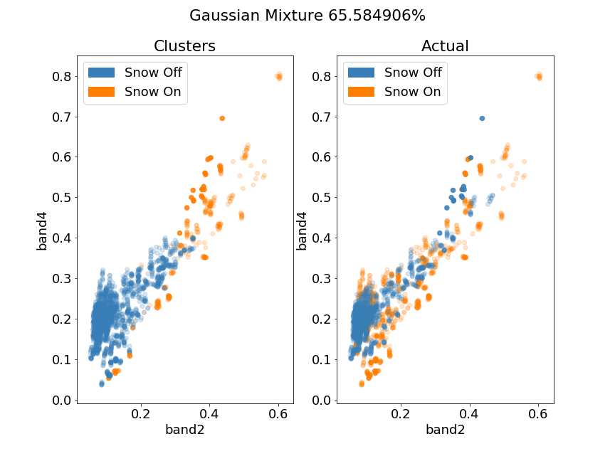

# planet-snowcover
> Assessing High-Resolution Cubesat Imagery for Detailed Snow Cover Estimation on Mt. Rainier: An Ecological Perspective

Tony Cannistra and Kavya Pradhan – CEE 573 Wi18 University of Washington, Seattle.

[**Results Presentation**](https://docs.google.com/presentation/d/174RDwsjo9BVH3Lxn2SKa70jmZlqzDUOFXx_y3du1Qvk/edit?usp=sharing) | [**Final Paper**](#)

## Introduction

Understanding the responses of species to climate change requires a robust understanding of the impact of abiotic (environmental) factors on habitat suitability and habitat availability at spatial scales relevant to the study species (Hannah et al. 2014). When studying plant species in montane ecosystems, snow cover is a particularly relevant abiotic factor in determining habitat suitability. However, remotely-sensed snow cover measurements are either captured at a spatial scale far too large to be relevant to the study species (e.g. MODIS SCA), or are appropriate in spatial scale but cost-prohibitive (e.g. LiDAR snow measurements). This project will evaluate the suitability of Planet data, a commercial satellite imagery product with unprecedented spatial (< 0.8 m) and temporal (< 5 day) resolution, for the purpose of acquiring detailed snow-cover and snow-melt data at ecologically-relevant scales. The challenge herein is the radiometric bandwidth available from Planet imagery: only Red, Green, Blue, and Near Infrared bands are measured by these satellites, which makes standard spectral snow cover indices like the Normalized Difference Snow Index (NDSI, Hall et al. 1995) unusable. We will develop a method for using this limited radiometric bandwidth to determine snow cover. 

## Study System 

We will focus our analysis of the usability of Planet data for acquiring snow cover information across Mt. Rainier National Park. The availability of snow presence/absence data through a vast network of iButton sensors acts as the ideal “ground-truthing” dataset since it can be used both for training and validating Planet based snow cover information. The figure shows their geographic distribution in 2017.

## Objectives

1. Develop a imagery pipeline which identifies snow cover in Planet imagery using two methods: 
   1. Machine learning classification
   2. Spectral mixture analysis (Adams and Adams 1985; Mustard and Pieters 1989)
1. Assess the accuracy of the Planet-derived snow cover using previously-derived iButton data with high spatial acuity.

## Rationale and Scope

The explosive growth and availability of satellite imagery at unprecedented spatial and temporal resolutions is expanding the potential of geospatial research. However, a majority of the studies that use such data are forced to operate under the assumption that pixel level climate information is sufficient to describe the environmental conditions that an individual organism is facing. Additionally, the necessity for temporal interpolation leads to the reduction of temporal accuracy in these studies. High spatial and temporal accuracy of snow presence/absence is especially important on Mt. Rainier as snow drives much of the seasonal hydrological regimes and can have significant ecological impacts on the plant communities. 
        Planet data is a promising source of high resolution imagery that can be used in ecological studies conducted in this system. However, its utility with respect to inferring snow cover is limited due to the narrowness of the near infrared band which makes distinguishing snow from clouds difficult using NDSI. As an alternative, we will develop two methods of determining snow - a machine learning algorithm and a spectral mixture analysis - and assess the effectiveness of each method.

## Research Management Plan

1. Data Acquisition
   1. Submit academic data request to Planet.com for Mt. Rainier study area (Tony + Kavya) (Completed).
   2. Verify access to Janneke HRL’s iButton data (Kavya) (Completed).
1. Computational Infrastructure 
   1. Depending on spatial scope + size of imagery delivered from Planet, use existing cloud compute + storage resources to host and examine imagery and perform analysis (Tony)
1. Model Development
   1. Using 5+ years of detailed iButton snow-cover measurements on Mt. Rainier (coupled with Planet imagery) as a training dataset, we will train a nonparametric machine learning model to classify imagery pixels as “snow” or “no-snow,” and validate our predictions.
   2. The iButton data is our “ground-truth” snow-cover information, which we will use to correlate Planet imagery to data. 
   3. Use Planet data to obtain Normalized Difference Vegetation Index (NDVI) to be used in model training 
   4. Plan:
      1. Assess data formats
      2. Determine appropriate model for these data
      3. Separate iButton data into training and testing sets
      4. Train snow cover model using iButton (training) data
1. Model Assessment (using the testing iButton dataset)
   1. Additional study sites include the Upper Tuolumne River Basin (California) and the Senator Beck Basin (Colorado) for which LIDAR snow cover data exist.
1. Manuscript Development

## Updates

1. We've acquired Planet Labs Ambassador status to get imagery (January 2017)
2. We've been able to download snow-on and snow-off images and extract pixel values. 
3. Some initial analysis of the data looks like this: 
	
	.
	
	 A Gaussian Mixture clustering on all bands (TOA reflectance) looks like this:
	
	

## References:        

Adams, J.B., Adams, J.D., 1984, Geologic mapping using Landsat MSS and ™ images: Removing vegetation by modeling spectral mixtures.  Third Thematic Conference on Remote Sensing for Exploration Geology, 615-622.

Hall, D.K., G.A. Riggs, V.V. Salomonson., 1995. Development of methods for mapping global snow cover using Moderate Resolution Imaging Spectrophotometer data.  Remote Sensing Environment, 54 , 127-140.

Hannah, L., Flint, L., Syphard, A.D., Moritz, M.A., Buckley, L.B., McCullough, I.M., 2014. Fine-grain modeling of species’ response to climate change: holdouts, stepping-stones, and microrefugia. Trends in Ecology & Evolution. 29, 390-397.

Mustard, J.F, Pieters, C. M., 1989. Photometric phase functions of common geologic minerals adn applications to quantitative analysis of mineral mixture reflectance spectra. Journal of geophysical research: Solid Earth, 94, 13619-13634
