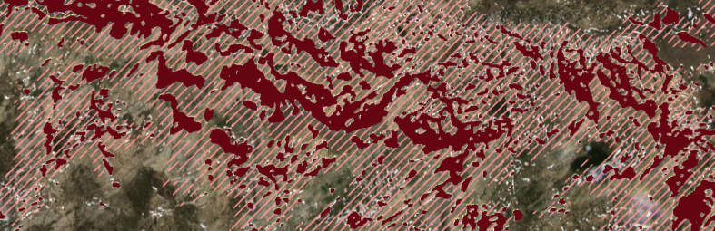

# Planet Snowcover

Planet Snowcover is a project that pairs airborne lidar and Planet Labs satellite imagery with cutting-edge computer vision techniques to identify snow-covered area at unprecedented spatial and temporal resolutions.

**Researchers**: *[Tony Cannistra](https://www.anthonycannistra.com) and Nicoleta Cristea*

## This Repository

This repository serves as the canonical source for the software and infrastructure necessary to sucessfully build and deploy a machine-learning based snow classifier using Planet Labs imagery and airborne lidar data.

* [Requirements](#requirements)
  * [Basic Requirements](#basic-requirements)
  * [Development Requirements](#development-requirements)
  * [Accounts + Data](#accounts-and-data)
* Infrastructure Deployment
* Tutorials
* Implementation Details
  * AWS Cloud Resources
  * Open Source Machine Learning
* Funding Sources
* [Original Research Proposal](#original-proposal)

## Requirements
### Basic Requirements
The goal of this work is to provide a toolkit that is relatively easy to deploy for someone with **working knowledge** of the following tools:

* Python 3
* Jupyter notebooks
* Basic command-line tools

More specific requirements can be found in the [Infrastructure Deployment](#infrastructure-deployment) section below.

### Development Requirements

This free, open-source software depends on a good number of other free, open-source software packages that permit this work. To understand the inner workings of this project, you'll need familiarity with the following:

* [PyTorch](https://pytorch.org)
* [Tensorflow](https://www.tensorflow.org)
* [scikit-image](https://scikit-image.org)
* [boto3](https://boto3.amazonaws.com/v1/documentation/api/latest/index.html) / [s3fs](https://s3fs.readthedocs.io/en/latest/)
* [Geopandas](https://github.com/geopandas/geopandas)
* [Rasterio](https://rasterio.readthedocs.io/en/stable/) / [rio-tiler](https://github.com/cogeotiff/rio-tiler)
* [mercantile](https://github.com/mapbox/mercantile) / [supermercado](https://github.com/mapbox/supermercado)

To build and manage our infrastructure, we use [Docker](https://www.docker.com) and [Terraform](https://www.terraform.io).

### Accounts and Data

<h4>
Amazon Web Services

</h4>

This project relies on cloud infrastructure from Amazon Web Services, which is a cloud services provider run by Amazon. AWS isn't the only provider in this space, but is the one we chose due to a combination of funding resources and familiarity. To run these tutorials and perform development tasks with this software, you'll need an AWS account. You can get one [here](https://aws.amazon.com/premiumsupport/knowledge-center/create-and-activate-aws-account/).

<h4>Planet Labs

</h4>

In order to access the imagery data from Planet Labs used to train our computer vision models and assess their performance, we rely on a relationship with collaborator [Dr. David Shean](https://dshean.github.io) in UW Civil and Environmental Engineering, who has access to Planet Labs data through a NASA Terrestrial Hydrology Program award.

If you're interested in getting access to Planet Labs imagery for research, check out the [Planet Education and Research Program](https://www.planet.com/markets/education-and-research/).

<h4>NASA Earthdata

</h4>

Finally, to gain access to the NASA/JPL Airborne Snow Observatory lidar-derived snow depth information, you need an account with NASA Earthdata. [Sign up here](https://urs.earthdata.nasa.gov/users/new).

## Infrastructure Deployment

To explore this work, and the tutorials herein, you'll need to deploy some cloud infrastructure to do so. This project uses [Docker](https://www.docker.com)and [Terraform](https://www.terraform.io) to manage and deploy consistent, reliable cloud infrastructure.

For detailed instructions on this process, view the [documentation](./deployment/).

## Tutorials

**something smart about tutorials**

## Original Proposal
To see the original resarch proposal for this project, now of date, view it [here](./original-proposal.md).
