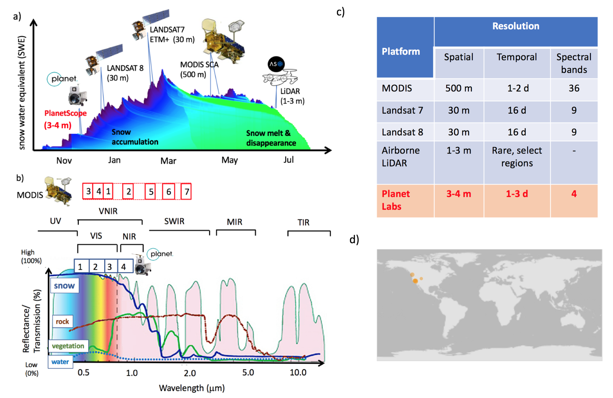
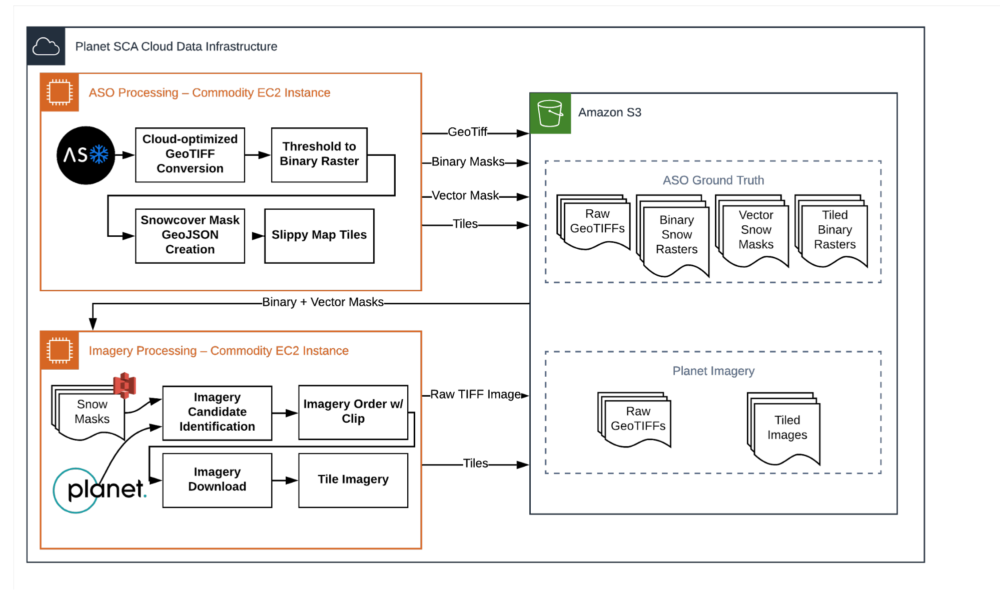

Introduction
------------

Understanding the responses of species to climate change requires a robust understanding of the impact of abiotic (environmental) factors on habitat suitability and habitat availability at spatial scales relevant to the study species (Hannah et al. 2014). When studying plant species in montane ecosystems, snow cover is a particularly relevant abiotic factor in determining habitat suitability. However, remotely-sensed snow cover measurements are either captured at a spatial scale far too large to be relevant to the study species (e.g. MODIS SCA), or are appropriate in spatial scale but cost-prohibitive (e.g. LiDAR snow measurements).

    a)Remote sensing platforms observing transitional snowpack (blue shades are lower, and green shades are higher snowpack density) b) Atmospheric transmission/ ground reflectance for the wavelengths used to observe snow cover c) Tradeoffs between spatial, temporal and spectral resolutions in the current sources, d) Locations of repeat LiDAR snow surveys

This project evaluates the suitability of Planet data, a commercial satellite imagery product with unprecedented spatial (< 0.8 m) and temporal (< 5 day) resolution, for the purpose of acquiring detailed snow-cover and snow-melt data at ecologically-relevant scales. The challenge herein is the radiometric bandwidth available from Planet imagery: only Red, Green, Blue, and Near Infrared bands are measured by these satellites, which makes standard spectral snow cover indices like the Normalized Difference Snow Index (NDSI, Hall et al. 1995) unusable. We develop a method for using this limited radiometric bandwidth to determine snow cover.

Technical Overview
------------------

Presented here generally, and laid out in more detail in other pages, is the general architecture of our method. We combine Planet imagery with lidar-derived snow area to create a "labeled training set" of images for our machine learning method. This computation is performed on `Amazon Web Services <https://aws.amazon.com>`_ infrastructure, a public cloud computing service. Below is a schematic of this process:

    Workflow components schematic for processing spatial data.
