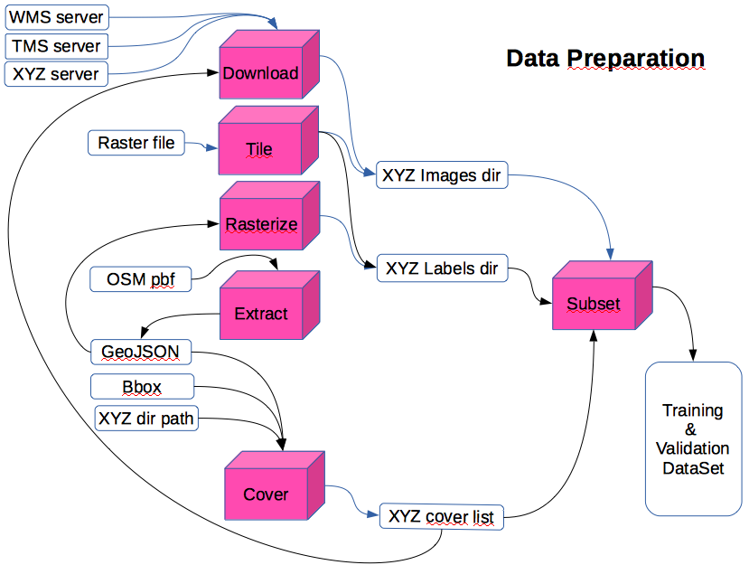
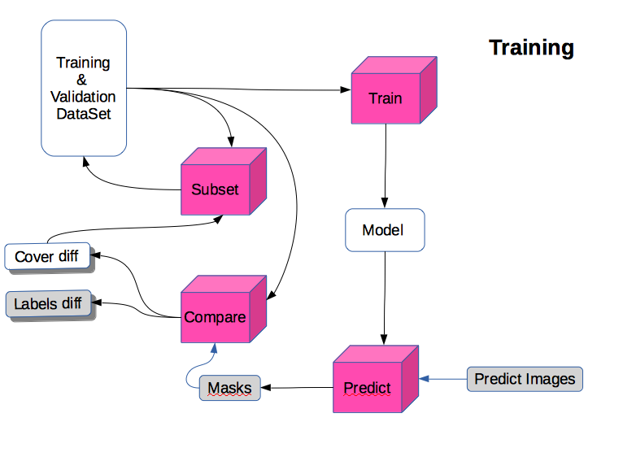
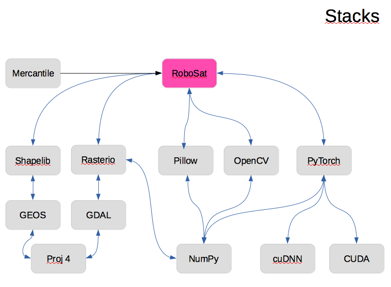

<h1 align='center'>RoboSat.pink</h1>
<h2 align='center'>Semantic Segmentation ecosystem for GeoSpatial Imagery</h2>


<p align=center>
  
</p>


This repository is a DataPink flavor of RoboSat, including our latests developments.

Spirit:
-------
- Cutting edge Computer Vision research papers implementation 
- Industrial code robustness
- Several tools, you can combine together (as Lego)
- Extensible, by design
- High performances
- Minimalism as a code aesthetic
- GeoSpatial standards compliancy
- OSM and MapBox ecosystems friendly


Aims:
-----
- DataSet Quality Analysis
- Change Detection highlighter
- Features extraction and completion


Install:
-------

**1) Prerequisites:**
   - Python >= 3.6 and PyTorch >= 0.4 installed, with related Nvidia GPU drivers, CUDA and CUDNN libs.
   - At least one GPU, with RAM GPU >= 6Go (default batch_size settings is targeted to 11Go).
   - Libs with headers: libjpeg, libwebp, libbz2, zlib, libboost. And Qt dependancies: libsm and libxrender.
     On a recent Ubuntu-server, could be done with:
 ```
     apt-get install build-essential libboost-python-dev zlib1g-dev libbz2-dev libjpeg-turbo8-dev libwebp-dev libsm6 libxrender1
 ```

 **2) Python libs Install:**
```
     python3 -m pip install -r requirements.txt
```
  NOTA: if you want to significantly increase performances switch from Pillow to <a href="https://github.com/uploadcare/pillow-simd">Pillow-simd</a>.


 **3) Deploy:**
  - Move the `rsp` command to a bin directory covered by your `PATH` (or update your `PATH`)
  - Move the robosat_pink dir to somewhere covered by your `PYTHONPATH` (or update your `PYTHONPATH`)


WorkFlows:
--------




Related resources:
-----------------

- <a href="./docs/from_opendata_to_opendataset.md">RoboSat.pink tutorial: from OpenData to OpenDataSet</a>
- <a href="./docs/extensibility_by_design.md">RoboSat.pink documentation: Extensibility by Design</a>
- <a href="http://www.datapink.com/presentations/2018-pyparis.pdf">Robosat slides @PyParis 2018</a>
- <a href="https://github.com/mapbox/robosat">MapBox RoboSat github directory</a>
- <a href="https://github.com/chrieke/awesome-satellite-imagery-datasets">Christoph Rieke's Awesome Satellite Imagery Datasets</a>
- <a href="https://github.com/mrgloom/awesome-semantic-segmentation">Mr Gloom's Awesome Semantic Segmentation</a>

Bibliography:
-------------

- <a href="http://www.cs.umanitoba.ca/~ywang/papers/isvc16.pdf">Optimizing IoU in Deep
Neural Networks for Image Segmentation</a>
- <a href="http://www.cs.toronto.edu/~wenjie/papers/iccv17/mattyus_etal_iccv17.pdf">DeepRoadMapper: Extracting Road Topology from Aerial Images</a>
- <a href="https://arxiv.org/abs/1705.08790">The Lovász-Softmax loss: A tractable surrogate for the optimization of the IoU measure in neural networks</a>
- <a href="https://arxiv.org/abs/1505.04597">U-Net: Convolutional Networks for Biomedical Image Segmentation</a>
- <a href="https://arxiv.org/abs/1512.03385">Deep Residual Learning for Image Recognition</a>
- <a href="https://arxiv.org/pdf/1804.08024.pdf">Angiodysplasia Detection and Localization Using Deep
Convolutional Neural Networks</a>
- <a href="https://arxiv.org/abs/1806.00844">TernausNetV2: Fully Convolutional Network for Instance Segmentation</a>
- <a href="https://hal.archives-ouvertes.fr/hal-01523573/document">Joint Learning from Earth Observation and
OpenStreetMap Data to Get Faster Better Semantic Maps</a>
- <a href="https://arxiv.org/abs/1712.02616">In-Place Activated BatchNorm for Memory-Optimized Training of DNNs</a>


Arch:
----



Contributions and Services:
---------------------------

- Pull Requests are welcome ! Feel free to send code...
  Don't hesitate either to initiate a prior discussion throught tickets on any implementation question.

- If you want to collaborate through code production and maintenance on a long term basis, please get in touch, co-edition with an ad hoc governance can be considered.

- If you want a new feature, but don't want to implement it, <a href="http://datapink.com">DataPink</a> provide core-dev services.

- Expertise and training on RoboSat.pink are also provided by <a href="http://datapink.com">DataPink</a>.

- And if you want to support the whole project, because it means for your own business, funding is also welcome.
