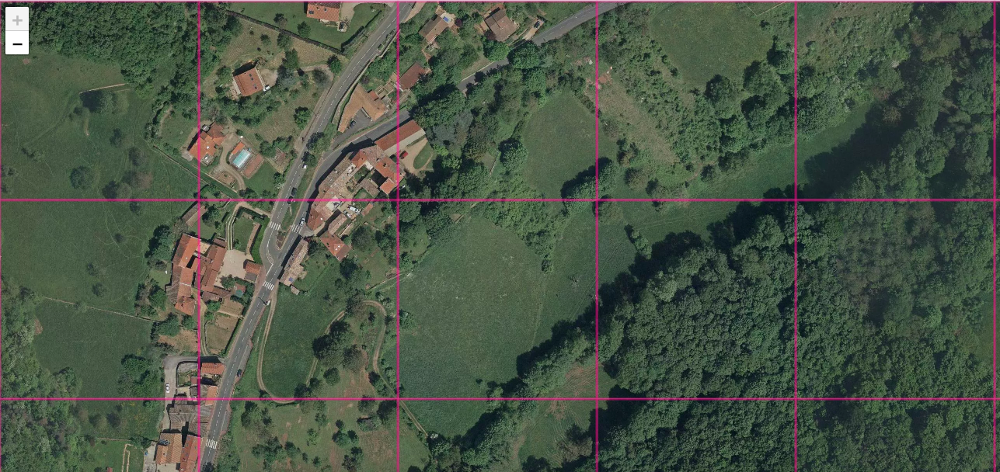
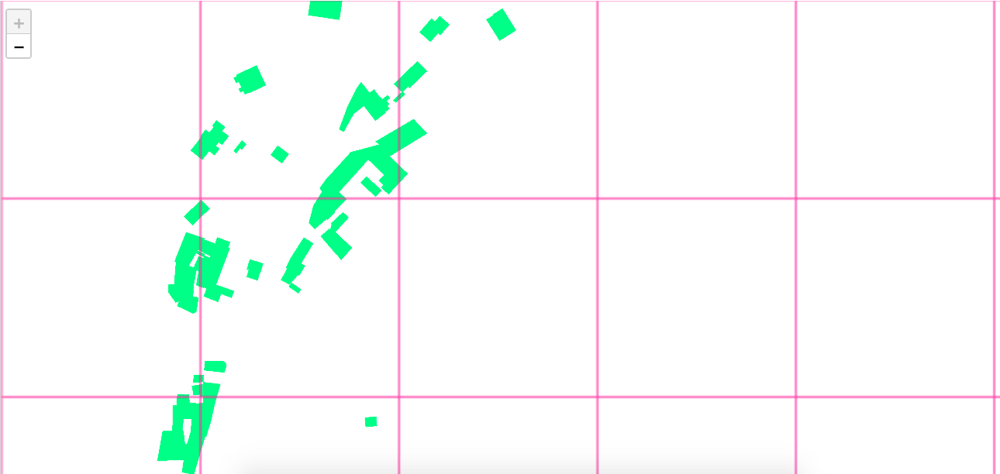
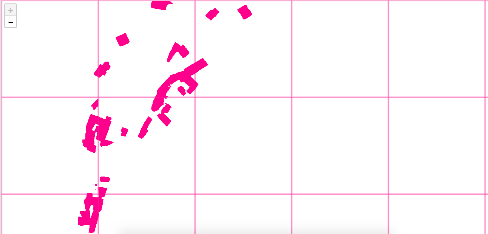
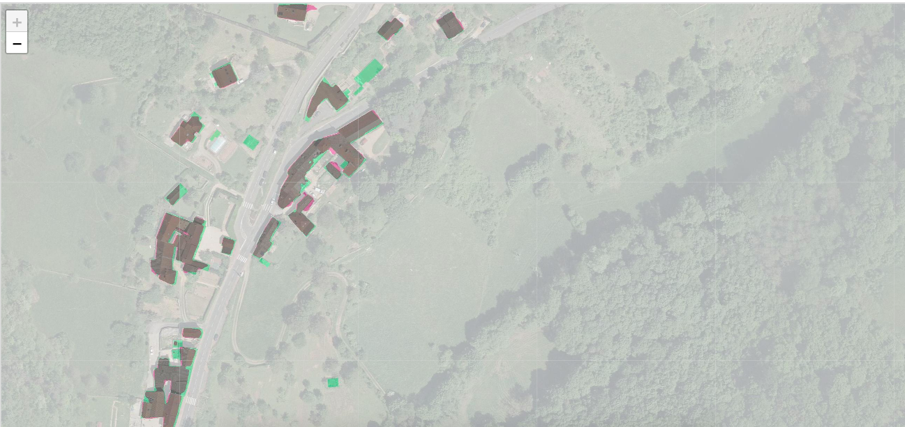
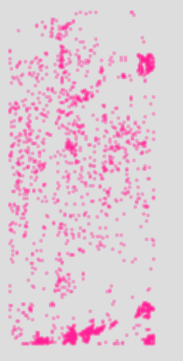
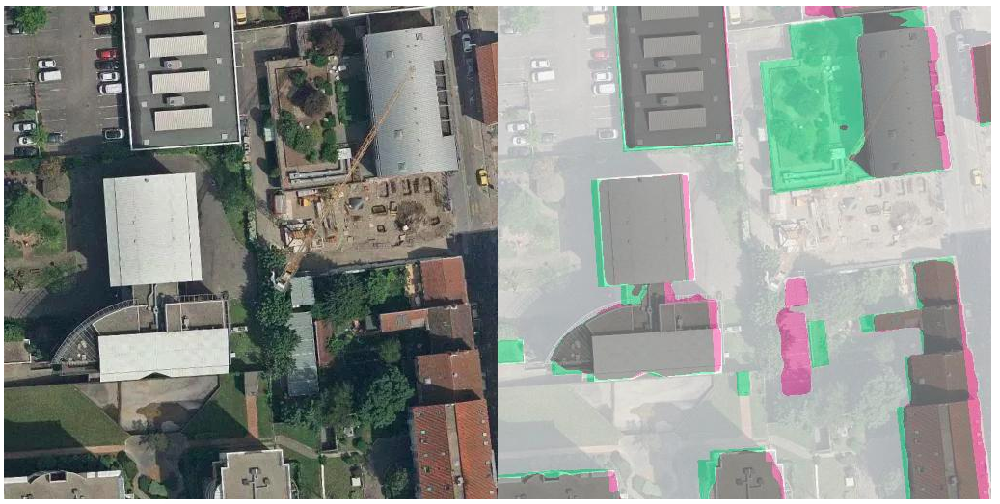
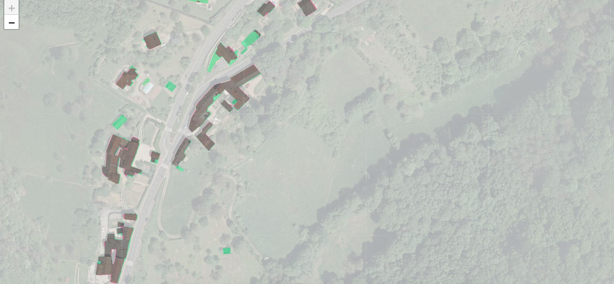
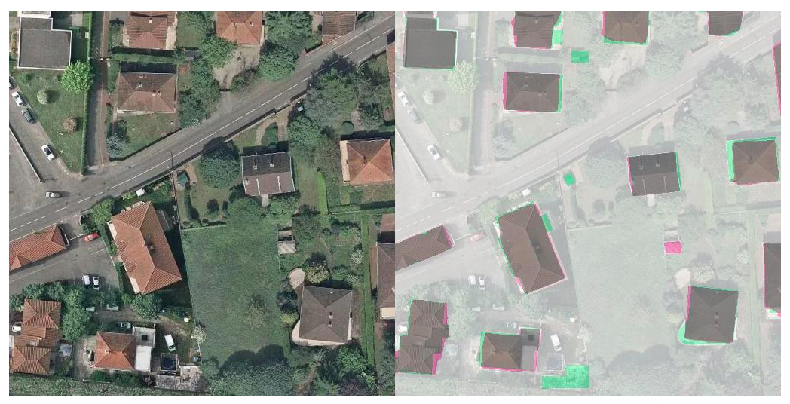

# From OpenData to OpenDataSet


Context:
-------

Data preparation could be a painful and time consuming task, if you don't use tools abstract and efficient enough.

In supervised learning, you can't expect to produce a good trained model, from inacurate labels: Garbage In Garbage Out.

OpenData became more and more available. But we still lack OpenDataSets good enough to be used as-is to train decents models.
And at the state of art, best results in model training are achieved by players who can afford to labelize by (small) hands and with pixel accuracy their own dataset.

So how could we retrieve and qualify OpenData in order to create our own training DataSet ?
That's what's this tutorial is about !


Retrieve OpenData:
------------------

We choose to use OpenData from <a href="https://rdata-grandlyon.readthedocs.io/en/latest/">Grand Lyon metropole</a> because they provide recent imagery and several vector layers throught standardized Web Services.


First step is to define the coverage geospatial extent and a <a href="https://wiki.openstreetmap.org/wiki/Zoom_levels">zoom level</a>:

```
rsp cover --zoom 18 --type bbox 4.795,45.628,4.935,45.853  ~/rsp_dataset/cover
```


Then to download imagery, throught <a href="https://www.opengeospatial.org/standards/wms">WMS</a>:

```
rsp download --type WMS 'https://download.data.grandlyon.com/wms/grandlyon?SERVICE=WMS&REQUEST=GetMap&VERSION=1.3.0&LAYERS=Ortho2015_vue_ensemble_16cm_CC46&WIDTH=512&HEIGHT=512&CRS=EPSG:3857&BBOX={xmin},{ymin},{xmax},{ymax}&FORMAT=image/jpeg' --web_ui --ext jpeg ~/rsp_dataset/cover ~/rsp_dataset/images
```

NOTA:
- Retina resolution of 512px is prefered to a regular 256px, because it will improve the training accuracy result. 
- Launch this command again, if any tile download error, till the whole coverage is fully downloaded.
- Jpeg is prefered over default webp only because some browser still not handle webp format


<a href="http://www.datapink.tools/rsp/opendata_to_opendataset/images/"></a>


Then to download buildings vector roof print, throught <a href="https://www.opengeospatial.org/standards/wfs">WFS</a>, 

```
wget -O ~/rsp_dataset/lyon_roofprint.json 'https://download.data.grandlyon.com/wfs/grandlyon?SERVICE=WFS&REQUEST=GetFeature&TYPENAME=ms:fpc_fond_plan_communaut.fpctoit&VERSION=1.1.0&srsName=EPSG:4326&outputFormat=application/json; subtype=geojson'
```

Roofprint choice is meaningful here, as we use aerial imagery to retrieve patterns. If we used building's footprints instead, our later training accuracy performances would be poorer.


Prepare DataSet
----------------

Now to transform the vector roofprints, to raster labels:

```
rsp rasterize --config config.toml --zoom 18 --web_ui ~/rsp_dataset/lyon_roofprint.json ~/rsp_dataset/cover ~/rsp_dataset/labels
```

<a href="http://www.datapink.tools/rsp/opendata_to_opendataset/labels/"></a>


Then to create a training / validation dataset, with imagery and related roofprint labels:

```
mkdir ~/rsp_dataset/training ~/rsp_dataset/validation

cat ~/rsp_dataset/cover | sort -R >  ~/rsp_dataset/cover.shuffled
head -n 16384 ~/rsp_dataset/cover.shuffled > ~/rsp_dataset/training/cover
tail -n 7924  ~/rsp_dataset/cover.shuffled > ~/rsp_dataset/validation/cover

rsp subset --web_ui --dir ~/rsp_dataset/images --cover ~/rsp_dataset/training/cover --out ~/rsp_dataset/training/images
rsp subset --web_ui --dir ~/rsp_dataset/labels --cover ~/rsp_dataset/training/cover --out ~/rsp_dataset/training/labels
rsp subset --web_ui --dir ~/rsp_dataset/images --cover ~/rsp_dataset/validation/cover --out ~/rsp_dataset/validation/images
rsp subset --web_ui --dir ~/rsp_dataset/labels --cover ~/rsp_dataset/validation/cover --out ~/rsp_dataset/validation/labels
```

Two points to emphasize there:
 - It's a good idea to take enough data for the validation part (here we took a 70/30 ratio).
 - The shuffle step help to reduce spatial bias in train/validation sets.


Train
-----

Now to launch a first model train:

```
rsp train --config config.toml ~/rsp_dataset/pth
```

After only 10 epochs, the building IoU metric on validation dataset, is about **0.82**. 
It's already a good result, at the state of art, with real world data, but we will see how to increase it.


Predict masks
-------------

To create predict masks from our first model, on the whole coverage:

```
rsp predict --config config.toml --checkpoint ~/rsp_dataset/pth/checkpoint-00010-of-00010.pth --web_ui ~/rsp_dataset/images ~/rsp_dataset/masks
```

<a href="http://www.datapink.tools/rsp/opendata_to_opendataset/masks/"></a>


Compare
-------

Then to compare how our first model reacts with this raw data, we compute a composite stack image, with imagery, label and predicted mask.

Color representation meaning is:
 - pink: predicted by the model (but not present in the initial labels)
 - green: present in the labels (but not predicted by the model)
 - grey: both model prediction and labels are synchronized.


```
rsp compare --images ~/rsp_dataset/images ~/rsp_dataset/labels ~/rsp_dataset/masks --mode stack --labels ~/rsp_dataset/labels --masks ~/rsp_dataset/masks --config config.toml --ext jpeg --web_ui ~/rsp_dataset/compare

rsp compare --mode list --labels ~/rsp_dataset/labels --maximum_qod 80 --minimum_fg 5 --masks ~/rsp_dataset/masks --config config.toml --geojson ~/rsp_dataset/compare/tiles.json
```

<a href="http://www.datapink.tools/rsp/opendata_to_opendataset/compare/"></a>

We launch also a csv list diff, to only keep tiles with a low Quality of Data metric (here below 80% on QoD metric as a threshold), and with at least few buildings pixels supposed to be present in the tile (5% of foreground building as a threshold).

And if we zoom back on the map, we could see tiles matching the previous filters:





And it becomes clear that some area are not well labelled in the original OpenData.
So we would have to remove them from the training and validation dataset.

To do so, first step is to select the wrong labelled ones, and the compare tool again is helpfull,
as it allow to check side by side several tiles directory, and to manual select thoses we want.

```
rsp compare --mode side --images ~/rsp_dataset/images ~/rsp_dataset/compare --labels ~/rsp_dataset/labels --maximum_qod 80 --minimum_fg 5 --masks ~/rsp_dataset/masks --config config.toml --ext jpeg --web_ui ~/rsp_dataset/compare_side
```

<a href="http://www.datapink.tools/rsp/opendata_to_opendataset/compare_side/"></a>


Filter
------

The result from the compare selection produce a csv cover list, in the clipboard.
We put the result in `~rsp_dataset/cover.to_remove`

Then we just remove all theses tiles from the dataset:
```
rsp subset --mode delete --dir ~/rsp_dataset/training/images --cover ~/rsp_dataset/cover.to_remove > /dev/null
rsp subset --mode delete --dir ~/rsp_dataset/training/labels --cover ~/rsp_dataset/cover.to_remove > /dev/null
rsp subset --mode delete --dir ~/rsp_dataset/validation/images --cover ~/rsp_dataset/cover.to_remove > /dev/null
rsp subset --mode delete --dir ~/rsp_dataset/validation/labels --cover ~/rsp_dataset/cover.to_remove > /dev/null
```

For information, we remove about 500 tiles from this raw dataset, in order to clean it up, from obvious inconsistency labelling.


Train 
-----

Then with a cleanest training and validation dataset, we can launch a new, and longer, training:

```
rsp train --config config.toml --epochs 100 ~/rsp_dataset/pth_clean
```

Building IoU metrics on validation dataset:
 - After 10  epochs: **0.84** 
 - After 100 epochs: **0.87**
 
 

Predict and compare
-------------------

And now to generate masks prediction, and compare composite images, as previously:

```
rsp predict --config config.toml --checkpoint ~/rsp_dataset/pth_clean/checkpoint-00100-of-00100.pth ~/rsp_dataset/images ~/rsp_dataset/masks_clean

rsp compare --images ~/rsp_dataset/images ~/rsp_dataset/labels ~/rsp_dataset/masks_clean --mode stack --labels ~/rsp_dataset/labels --masks ~/rsp_dataset/masks_clean --config config.toml --web_ui --ext jpeg ~/rsp_dataset/compare_clean

rsp compare --mode list --labels ~/rsp_dataset/labels --maximum_qod 80 --minimum_fg 5 --masks ~/rsp_dataset/masks_clean --config config.toml --geojson ~/rsp_dataset/compare_clean/tiles.json
```

<a href="http://www.datapink.tools/rsp/opendata_to_opendataset/compare_clean/"></a>


And to compare only with filtered validation tiles, in side by side mode: 

```
rsp cover --type dir ~/rsp_dataset/validation/images  ~/rsp_dataset/validation/cover.clean

rsp subset --dir ~/rsp_dataset/compare_clean --cover ~/rsp_dataset/validation/cover.clean --out ~/rsp_dataset/validation/compare_clean

rsp subset --dir ~/rsp_dataset/masks_clean --cover ~/rsp_dataset/validation/cover.clean --out ~/rsp_dataset/validation/masks_clean

rsp compare --mode side --images ~/rsp_dataset/validation/images ~/rsp_dataset/validation/compare_clean --labels ~/rsp_dataset/validation/labels --masks ~/rsp_dataset/validation/masks_clean --config config.toml --web_ui --ext jpeg ~/rsp_dataset/validation/compare_side_clean
```

<a href="http://www.datapink.tools/rsp/opendata_to_opendataset/compare_side_clean/"></a>
